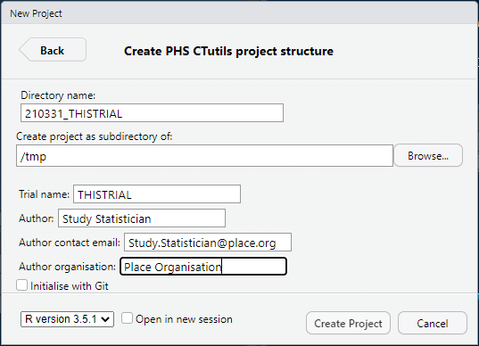

# CTtemplate

This package allows the user to initialise a project directory
within RStudio that is compatible with the CTutils package and 
workflow.

After installing and loading the package, a "PHS CTutils project
structure" option should appear in the File > New Project >
New Directory list.

Once this is selected, you can choose to enter the following
details:

This will initiate a project, with a skeleton directory sturcture
and some template Rmarkdown files.

More documentation will follow.
